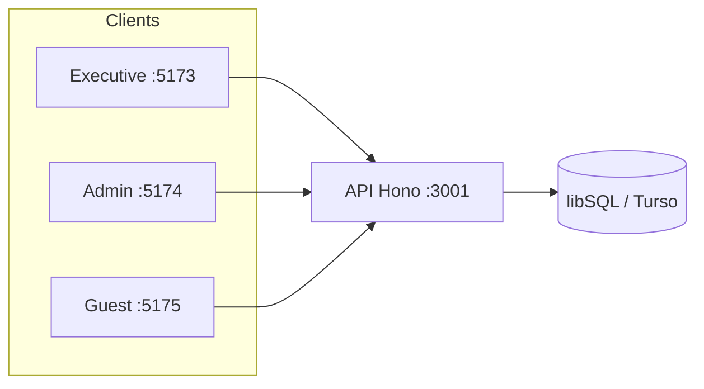
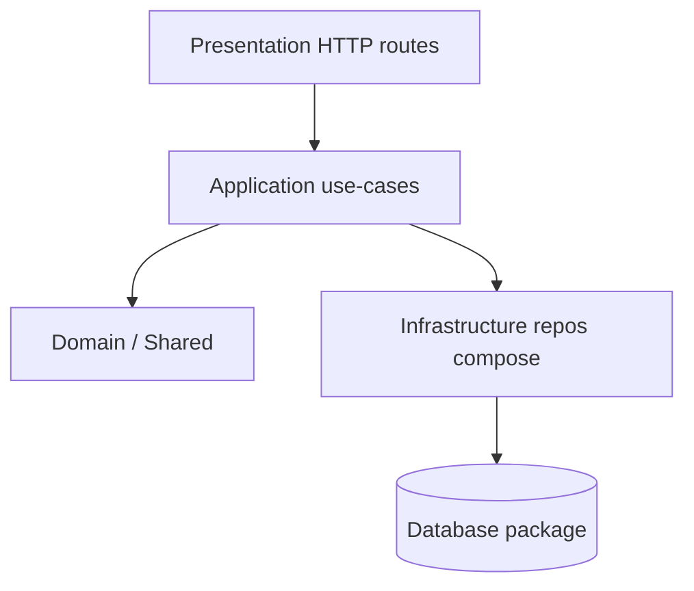

# Architecture — System Overview

**Version:** 1.0  
**Status:** ✅ Approved (PO, 2026-07-18)  
**Owner:** Chief Architect

## Runtime topology

## Layering (Clean Architecture)

## Apps responsibility

| App | Scope |
|-----|--------|
| Executive | Chain KPIs, attention tower, Turbo, briefings, CIO digest, Org Comms, Trust |
| Admin | Hotel rooms/bookings, facilities, attendance, kashrut |
| Guest | Stay lookup/hub, legal docs, feedback |
| API | Auth, ops, turbo, trust, knowledge, kashrut, org-comms |

## ADR map

| ADR | Topic |
|-----|--------|
| 0001 | Monorepo |
| 0003 | Three apps |
| 0004 | Turbo OS |
| 0005 | Trust / attendance |
| 0006 | libSQL/Turso |
| 0007 | CIO / Kashrut / Org Comms |

See also: [05a-ai-architecture.md](../engineering-standard/05a-ai-architecture.md).
