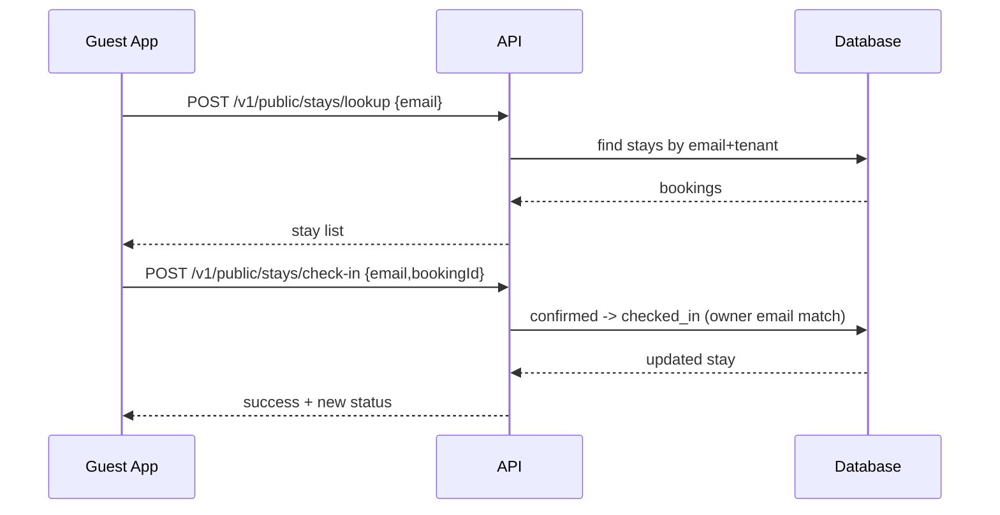

# Sequence — Guest digital check-in

**Version:** 1.0 · **Status:** ✅ Approved

```mermaid
sequenceDiagram
  participant G as Guest App
  participant API as API
  participant DB as Database
  G->>API: POST /v1/public/stays/lookup {email}
  API->>DB: find stays by email+tenant
  DB-->>API: bookings
  API-->>G: stay list
  G->>API: POST /v1/public/stays/check-in {email,bookingId}
  API->>DB: confirmed -> checked_in (owner email match)
  DB-->>API: updated stay
  API-->>G: success + new status
```
