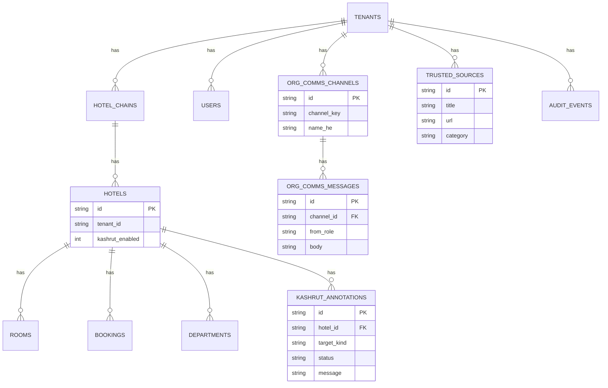

# ERD — Hotel core + ADR 0007

**Version:** 1.0  
**Status:** ✅ Approved (PO, 2026-07-18)  
**Source of truth:** `packages/database/src/schema` + `client.ts` migrate

Logical DBs (Vol. 6) may split later; v1 is a single libSQL file/Turso DB with tenant isolation in queries.
