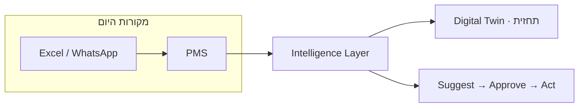

# HotelOS AI — מיצוב תחרותי ו־Wedge

מקור: ניתוח חוזקות / פערים מול השוק (אוג׳ 2026).  
עקרון מוצר: **Intelligence Layer מעל מערכות קיימות** — לא rip-and-replace PMS ([GR-016](../engineering-standard/00-INDEX.md), [`hotel-intelligence-platform.md`](./hotel-intelligence-platform.md)).

---

## מפת חוזקות (מצב נוכחי)

| תחום | מצב ב־HotelOS AI | הערכה |
|------|------------------|--------|
| ניהול עובדים | מתקדם | חזק |
| AI למנהלים | מתקדם | חזק מאוד |
| תרגום עובדים / צ׳אט רב־לשוני | קיים | יתרון |
| בריפינג AI | קיים | יתרון |
| HR | קיים | טוב |
| Compliance | קיים | טוב |
| Guest App | קיים | טוב |
| Multi Hotel | קיים | חזק |
| Voice AI | קיים | חדשני |
| אוטומציות + סוכנים (HITL) | קיים | חזק |

**מסקנה:** הרוחב הוא נכס *אחרי* שמוכיחים ערך בפיילוט — לא כמסר פתיחה. בפתיחה מוכרים **בעיה אחת שנפתרת היטב** + הבטחת שכבה שמאחדת.

---

## איפה השוק עדיין מתקשה

מלונות רצים על ערימת מערכות נפרדות:

| מערכת | תפקיד |
|-------|--------|
| PMS | הזמנות / חדרים |
| HR | עובדים |
| הנה״ח | כספים |
| CRM | אורחים / נאמנות |
| תחזוקה | תקלות / ציוד |
| BI | דוחות מאוחרים |
| אפליקציית עובדים | צ׳אט / משימות |

**תוצאה:** מידע מפוזר, עבודה כפולה, אינטגרציות שבירות.

אם HotelOS **באמת** מאחד אותות ממערכות שונות ומציג אותם כהחלטות/אוטומציות (לא עוד דשבורד מת) — זה הבידול.

---

## יכולות «לחיזוק» — מה כבר יש ומה חסר

| יכולת | מצב בקוד / תכנון | פעולת GTM |
|--------|------------------|-----------|
| Digital Twin | ✅ overlays + **ציוד חי** (HVAC / מעליות / מים·דודים) + **SSE חי** (`GET /v1/streams/ops-dashboard`) + fallback 30ש׳ | concurrent stream caps בענן |
| Predictive Maintenance | MVP + Twin overlay + Incident summary בדשבורד | דומיין פיילוט ברור |
| Revenue Optimization | ✅ HITL + forecast + simulator + לוח עונות/אירועים | תמיד עם HITL — אמון CFO |
| Guest 360 | ✅ API + קליק הגעה בקבלה + שהיות ברשת + משוב | נאמנות/נקודות — roadmap |
| AI Copilot לפי תפקיד | ✅ Work Copilot תפעול + כספים + Admin | להרחיב משמרת / שטח |
| Knowledge Graph | ✅ MVP — `GET /v1/ops/knowledge-graph` + Executive UI | להרחיב edges מדידים לפיילוט |
| Marketplace מודולים | ✅ קטלוג + **enablement לפי מלון** (`enabled_integration_domains`, Admin toggles) — ללא סודות | secrets / install flow אחרי 2–3 מחברי live |
| Open API רחב | ✅ OpenAPI 3.1 YAML + `GET /v1/meta/openapi.yaml` | DX / מפתחים אחרי יציבות פיילוט |
| HITL שקיפות | ✅ payload מסונן + החלטות אחרונות ב־Admin/Executive | audit read API מלא — בהמשך |
| Pilot ROI | ✅ 7 מדדים + baseline מקומי + Admin tab | מדידה אמיתית בפיילוט בלבד |

---

## במה מובילים עדיין לא מושלמים (בלי שמות)

1. ממשקים מיושנים  
2. עבודה ידנית רבה  
3. AI שעונה — לא מפעיל תהליכים  
4. ריבוי מערכות בלי תמונה אחידה  
5. חוסר תובנות חוצות־רשת  
6. קושי בשפות / צוותים רב־לשוניים  

**ההיפך שלנו (מסר):** AI שמפעיל תהליך (Suggest→Approve→Act) · תמונה אחידה לרשת · צ׳אט מתורגם · לא מחליפים PMS.

---

## טבלת השוואת קטגוריות

מראה את אותה טבלה שבדף הנחיתה (`#compare` ב־`apps/www`) — בלי שמות ספקים, עם מסר wedge ישיר.

| קטגוריה בשוק | כאב טיפוסי | תשובת HotelOS |
|--------------|------------|---------------|
| PMS / suite מלאה | פרויקט החלפה ארוך, התנגדות צוות, ועדיין בלי סוכנים שמפעילים תהליכים | מחברים את ה-PMS הקיים — Intelligence Layer מעל, לא rip-and-replace |
| כלי AI נקודתי / צ׳אטבוט | עונה על שאלות — לא יוצר משימות, לא מאחד מערכות, בלי אישור אנושי | סוכנים + Suggest → Approve → Act על תדריך, תקלות ותחזוקה |
| דשבורד BI בלבד | מראה אתמול — לא מציע פעולה; עוד מסך לנתח ידנית | תמונה חיה + תחזית + אוטומציות עם HITL — לא רק גרפים |
| אפליקציית עובדים מבודדת | צ׳אט פנימי בלי PMS, תחזוקה או כספים — עוד silo במקום תמונה אחת | צ׳אט מתורגם + משימות על אותם אותות מהשכבה — Work Copilot לפי תפקיד |
| **HotelOS Intelligence Layer** | דורש אינטגרציות אמינות — לא קסם ביום אחד; מתחילים מ-wedge מצומצם | פיילוט: תדריך מנכ״ל + תקלות + תחזוקה חזויה — land & expand אחרי הוכחה |

**Digital Twin / SSE:** `GET /v1/streams/ops-dashboard` עם Bearer + ACL מלון/דייר, budget נפרד לחיבורים, ומעבר אוטומטי ל־polling אם הזרם נופל. ראו [`docs/security/live-stream-threat-model.md`](../security/live-stream-threat-model.md).

### זרימת ערך (מסגרת, לא ROI)

---

## נקודת הבידול האמיתית

> **Intelligence Layer** שמתחברת מעל המערכות הקיימות ואינה מחייבת להחליף אותן.

תנאי להפיכת זה ליתרון אמיתי (לא סלוגן):

1. **אינטגרציות אמינות** — לפחות PMS אחד live + דומיין כאב אחד (VMS / reputation / forecast).  
2. **ערך ברור למנהל** — תדריך / תחזית / תקלות בלי אקסל.  
3. **ערך ברור לעובד** — משימה + תרגום + פחות וואטסאפ.  
4. **ROI מדיד** — [`pilot-roi-scorecard.md`](./pilot-roi-scorecard.md) בלבד; בלי מספרים מומצאים.

---

## חשוב לזכור

1. **רוחב ≠ Wedge.** בעולם מנצחים מי שפותרים בעיה אחת מצוין *או* בונים אקוסיסטם עם אינטגרציות אמינות. HotelOS שואפת לשניהם — אבל **סדר הפעולות** הוא:  
   - קודם wedge לפיילוט (תדריך מנכ״ל + תמונת תפעול / תקלות, מעל PMS).  
   - אחר כך land & expand לדומיינים (HR, VMS, revenue, energy…).  
2. **לא למכור «הכל» במצגת ראשונה.** המצגת פותחת בפיצול מערכות → Intelligence Layer → 2–3 תוצאות → פיילוט. הרוחב נשאר ב־appendix / product tour.  
3. **AI בלי תהליך = עוד צ׳אט.** הבידול הוא אוטומציה עם HITL, לא תשובות יפות.  
4. **אמון לפני marketplace.** Open API / חנות מודולים — אחרי שהשכבה מוכיחה ערך ברשת אמיתית.  
5. **GR-016 נשאר קו אדום:** לא מחליפים PMS ביום הראשון; מחברים ומשפרים.

---

## Wedge מומלץ לפיילוט (ברירת מחדל)

| עדיפות | Wedge | למה |
|--------|--------|-----|
| 1 | AI Executive Briefing + תחזית / אנומליות | כאב מנכ״ל/COO מדיד; חוזקה קיימת |
| 2 | Incident / Predictive + Digital Twin | «תמונה אחת» במקום 5 מערכות |
| 3 | צ׳אט מתורגם + משימות | יתרון ייחודי מול צוותים רב־לשוניים |

הרחבה לרשת: HR · Compliance · Guest · Revenue HITL — אחרי הוכחת #1–#2.

---

## קישורי המשך

- שיווק תוצאות: [`gtm-outcomes-pitch.md`](./gtm-outcomes-pitch.md)  
- HIP + connectors: [`hotel-intelligence-platform.md`](./hotel-intelligence-platform.md)  
- Must-have pack: [`must-have-growth.md`](./must-have-growth.md)  
- דף נחיתה: `apps/www` · `pnpm dev:www`
