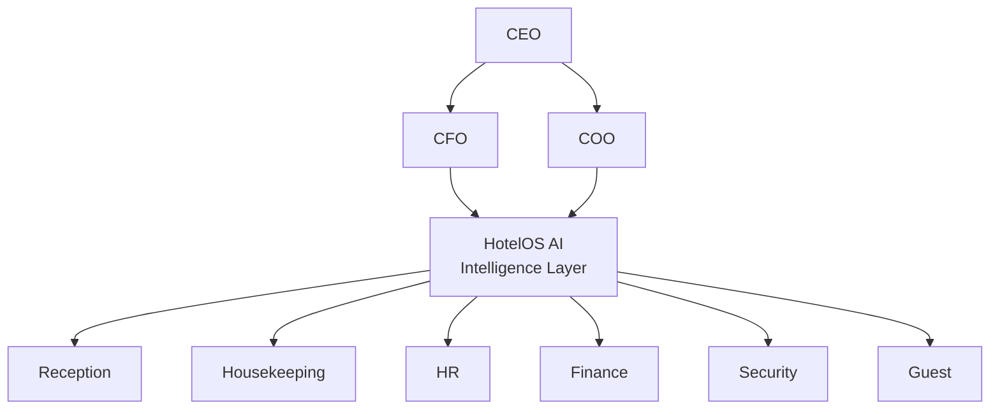

# HotelOS AI — מוכרים תוצאות, לא תוכנה

מנהלי מלונות ורשתות **קונים תוצאות**: פחות זמן ניהול, פחות טעויות, יותר הכנסות נלוות, שירות יציב.  
HotelOS AI ממוקמת כ־**Operating System / Intelligence Layer** — לא כעוד מערכת הזמנות.

**דף נחיתה חי:** אפליקציית `@hotelos/www` · `pnpm dev:www` · http://localhost:5177

**כלל זהב לשיווק:** רק מה שחי בקוד. אין SOC 2 / ISO attestation, אין מצג PCI-DSS של HotelOS, אין «full Vector RAG». ראו [trust-center-mvp.md](./trust-center-mvp.md) · [rag-embeddings-mvp.md](./rag-embeddings-mvp.md).

---

## Readiness board

| סטטוס | פריט |
|--------|------|
| **Closed (MVP)** | Trust Center product surfaces — legal, `#trust` / `#status`, HITL, WebAuthn/OAuth, rate limits, no PAN in HotelOS |
| **Closed (MVP)** | RAG **hybrid** — keyword + optional whole-doc / per-chunk embeddings + citations (not Vector DB / ANN) |
| **Closed (MVP)** | Trusted allowlist **page fetch → snapshot (+ best-effort embed)** all categories |
| **Remaining** | Certifications (SOC 2 / ISO) · counsel-signed DPA per customer |
| **Remaining** | Employee depth (HR dossier / advanced workflows; Work claim + invite + assessments MVP live) |
| **Remaining** | WCAG full suite (beyond login + www/guest shells + invite/privacy deep paths) |

---

## שקף 1 — המשפט הפותח

> **HotelOS AI is the Intelligence Layer for Hotels.**  
> We connect people, operations, finance, AI, compliance and guest experience into one unified operating system.

מיקום: פלטפורמה אסטרטגית · לא "עוד PMS".

---

## כאב → עלות → תוצאה (HotelOS) — חי מול roadmap

| כאב של המלון | העלות למלון | מה HotelOS AI עושה | סטטוס |
|--------------|-------------|---------------------|--------|
| מנהלים מבזבזים זמן על דוחות | שעות עבודה רבות בכל שבוע | **AI Executive Briefing** (CIO digest / Meet + מזכירה) | **Live** |
| מחסור בעובדים | ירידה בשירות ועלייה בעלויות | Work / HR agent + תרגום 10 שפות + אוטומציות בסיסיות | **Live (wedge)** · Employee depth — **roadmap** |
| חדרים לא מוכנים בזמן | אובדן הכנסות ואי־שביעות רצון | Housekeeping AI + תיעדוף / room prep | **Live (MVP)** |
| מידע מפוזר בין מערכות | החלטות איטיות | Dashboard אחד לרשת (Executive) מעל PMS | **Live** |
| תקלות שלא מטופלות בזמן | פיצויים ותלונות | Alerts · Incident Center · equipment / reputation ingest | **Live (MVP)** · Predictive Maint depth — **roadmap / stub** |
| תקשורת בין מחלקות | טעויות ועיכובים | Chat מתורגם (Turbo i18n) | **Live** |

---

## שקף חזק — מערכת הפעלה למלון

```text
HotelOS AI = Operating System for Hotels

                CEO
                 │
        ┌────────┴────────┐
        │                 │
      CFO              COO
        │                 │
        └──────┬──────────┘
               │
          HotelOS AI
               │
 ┌──────┬──────┬──────┬──────┬──────┐
 │      │      │      │      │
Reception HK   HR  Finance Security …
 └──────┴──────┴──────┴──────┴──────┘
               │
            Guest
```



> דיאגרמה זו היא **מיצוב** (שכבה מעל מחלקות) — לא רשימת מודולים שכולם באותה עומק במוצר.

---

## מסרים שיווקיים (מפחיתים התנגדות)

1. **One AI Platform. Every Hotel. Every Employee. Every Guest.**
2. **The Intelligence Layer Above Every Hotel System.**
3. **We don't replace your PMS. We make it smarter.**

בחירה מומלצת לרשתות עם Opera/Protel/Fidelio/Clock: מסר **#3** + מסר **#2**.

---

## גרף — רמת דיגיטליזציה (המחשה למצגת)

```text
100% ┤                           HotelOS AI
 90% ┤                              ●
 80% ┤
 70% ┤
 60% ┤
 50% ┤             PMS
 40% ┤             ●
 30% ┤
 20% ┤
 10% ┤ Excel / WhatsApp / Email
  0% └─────────────────────────────────────
```

**מסר:** רוב המלונות כבר מנהלים הזמנות ב־PMS — חסרה **שכבת אינטליגנציה** שמחברת אנשים, מחלקות ואורח.  
**הערה:** הגרף הוא איור כיוון — לא מדד מדוד של «אחוז דיגיטליזציה».

---

## גרף ערך למנכ״ל — המחשה בלבד

> ⚠️ **לא נתוני מחקר.** להצגה כאיור כיוון בלבד.  
> מספרים אמיתיים — רק מ־[`pilot-roi-scorecard.md`](./pilot-roi-scorecard.md) / `GET /v1/ops/pilot-roi` אחרי מדידת פיילוט.

| מדד | לפני (איור) | אחרי (איור) |
|-----|-------------|-------------|
| זמן ניהול | גבוה | נמוך משמעותית |
| זמן החלטות | גבוה | קצר (תדריך + תחזית) |
| עבודת ניירת | גבוה | מינימלי |
| שיתוף מידע | חלש | גבוה (צ׳אט + דשבורד + אירועים) |

---

## מבנה מצגת 20–25 שקפים (רמת Salesforce / Monday)

| # | שקף | תוכן | הערת כנות |
|---|-----|------|-----------|
| 1 | Title | משפט פותח + לוגו | |
| 2 | Problem | כאבי רשת מלון (טבלה למעלה) | |
| 3 | Cost of inaction | שעות / תלונות / הכנסות אבודות (איכותי עד שיש פיילוט) | בלי מספרים מומצאים |
| 4 | Insight | PMS ≠ Intelligence | |
| 5 | Solution | OS diagram | מיצוב, לא checklist פיצ׳רים |
| 6 | Tagline | We don't replace your PMS… | |
| 7 | Digitization curve | Excel → PMS → HotelOS | איור בלבד |
| 8 | Outcomes map | כאב→תוצאה × 6 עם Live/Roadmap | |
| 9 | Product tour | Executive / Admin / Work / Guest | מה חי בדמו |
| 10 | AI layer | Gateway + agents + HITL | AI רק דרך Gateway |
| 11 | Integrations | דומיינים מודולריים | stubs ≠ live connector |
| 12 | Security & compliance | Audit, trust surfaces, תיקון 13 checklist, meetings | **אין** SOC 2 / ISO / HotelOS PCI-DSS |
| 13 | Pilot model | 30–90 יום, דומיין אחד–שניים | |
| 14 | ROI scorecard | מדדים מדידים בלבד | |
| 15 | Case placeholder | מקום לנתוני פיילוט אמיתיים | ריק עד שיש פיילוט |
| 16 | Competitive landscape | PMS / channel / point AI tools vs layer | |
| 17 | Moat | Multi-tenant + ops graph + agents + connectors | |
| 18 | GTM | רשתות → פיילוט → land & expand domains | |
| 19 | Pricing sketch | לפי מלון / חדר / דומיין (טיוטה — לא מחייב) | |
| 20 | Market | Hospitality software + AI ops TAM (מקור חיצוני + תאריך) | |
| 21 | Roadmap | Readiness board + next | Employee depth, WCAG suite, certs (Trusted fetch+embed MVP closed) |
| 22 | Team | | |
| 23 | Ask | גיוס / פיילוט רשת | |
| 24 | Appendix | ארכיטקטורה, מסכים | RAG = hybrid MVP, not Vector DB |
| 25 | Contact | | |

---

## קישור למוצר בפועל

| תוצאה שיווקית | יכולת בקוד | סטטוס |
|---------------|------------|--------|
| AI Executive Briefing | CIO digest, Meet secretary, Forecast | **Live** |
| AI HR + תרגום | Work / HR agent, `@hotelos/i18n`, invite + assessments MVP | **Live (wedge)** · depth → roadmap |
| Housekeeping AI | ops tasks, room prep, anomalies | **Live (MVP)** |
| Dashboard אחד | Executive chain + Incident Center | **Live** |
| AI Alerts | reputation, equipment, Sentry, VMS | **Live (MVP)** |
| Chat מתורגם | Turbo staff chat | **Live** |
| Trust / legal | `#trust`, legal docs, DPA **template**, payments status | **Live** · certs / signed DPA → roadmap |
| Knowledge / RAG | Hybrid keyword + optional embeddings + citations + Trusted snapshots/embed | **Live (hybrid MVP)** · Vector DB / ANN → roadmap |

מיצוב טכני: [`hotel-intelligence-platform.md`](./hotel-intelligence-platform.md)  
מדדי פיילוט: [`pilot-roi-scorecard.md`](./pilot-roi-scorecard.md)  
מיצוב תחרותי / wedge: [`competitive-wedge.md`](./competitive-wedge.md)  
Trust: [`trust-center-mvp.md`](./trust-center-mvp.md)  
RAG: [`rag-embeddings-mvp.md`](./rag-embeddings-mvp.md)

---

## שקף תחרות — למה לא «עוד suite»

| גישת מתחרים נפוצה | HotelOS |
|-------------------|---------|
| מחליפים PMS / סוויטה מלאה | שכבה מעל Opera / Protel / Fidelio / Clock |
| AI שעונה בצ׳אט | AI שמפעיל תהליך (Suggest→Approve→Act) |
| מערכת לכל מחלקה | תמונה אחת לרשת + צ׳אט מתורגם |
| מצגת רחבה בלי מדידה | פיילוט עם [`pilot-roi-scorecard.md`](./pilot-roi-scorecard.md) |
| «SOC2 / PCI / Vector RAG» כסיסמת שיווק | בקרות חיות בלבד — בלי הסמכות שלא הושלמו |

**חשוב לזכור:** מוכרים קודם wedge אחד (תדריך + תפעול מעל PMS); את הרוחב מרחיבים אחרי ROI — ראו [`competitive-wedge.md`](./competitive-wedge.md).
