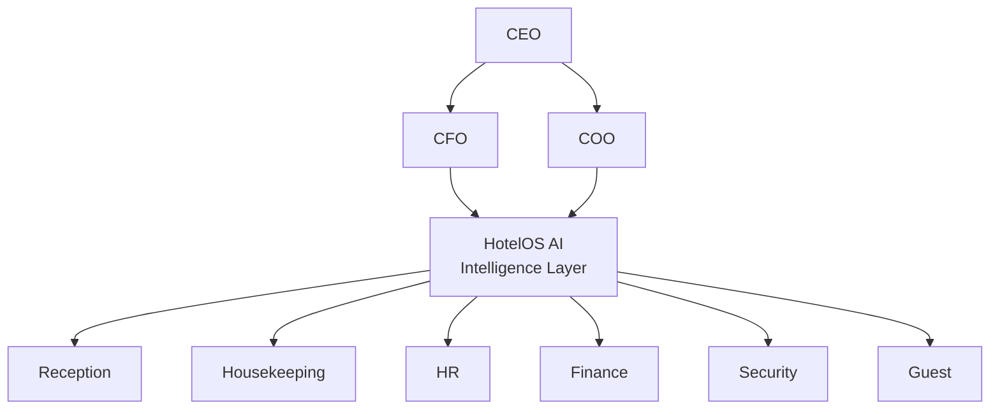

# HotelOS AI — מוכרים תוצאות, לא תוכנה

מנהלי מלונות ורשתות **קונים תוצאות**: פחות זמן ניהול, פחות טעויות, יותר הכנסות נלוות, שירות יציב.  
HotelOS AI ממוקמת כ־**Operating System / Intelligence Layer** — לא כעוד מערכת הזמנות.

---

## שקף 1 — המשפט הפותח

> **HotelOS AI is the Intelligence Layer for Hotels.**  
> We connect people, operations, finance, AI, compliance and guest experience into one unified operating system.

מיקום: פלטפורמה אסטרטגית · לא "עוד PMS".

---

## כאב → עלות → תוצאה (HotelOS)

| כאב של המלון | העלות למלון | מה HotelOS AI עושה |
|--------------|-------------|---------------------|
| מנהלים מבזבזים זמן על דוחות | שעות עבודה רבות בכל שבוע | **AI Executive Briefing** אוטומטי (CIO digest / Meet + מזכירה) |
| מחסור בעובדים | ירידה בשירות ועלייה בעלויות | **AI HR** + תרגום 10 שפות + אוטומציות |
| חדרים לא מוכנים בזמן | אובדן הכנסות ואי־שביעות רצון | **Housekeeping AI** + תיעדוף משימות / room prep |
| מידע מפוזר בין מערכות | החלטות איטיות | **Dashboard אחד** לרשת (Executive) מעל PMS |
| תקלות שלא מטופלות בזמן | פיצויים ותלונות | **AI Alerts** · Incident Center · Predictive Maint |
| תקשורת בין מחלקות | טעויות ועיכובים | **Chat מתורגם** לכל שפה (Turbo i18n) |

---

## שקף חזק — מערכת הפעלה למלון

```text
HotelOS AI = Operating System for Hotels

                CEO
                 │
        ┌────────┴────────┐
        │                 │
      CFO              COO
        │                 │
        └──────┬──────────┘
               │
          HotelOS AI
               │
 ┌──────┬──────┬──────┬──────┬──────┐
 │      │      │      │      │
Reception HK   HR  Finance Security …
 └──────┴──────┴──────┴──────┴──────┘
               │
            Guest
```



---

## מסרים שיווקיים (מפחיתים התנגדות)

1. **One AI Platform. Every Hotel. Every Employee. Every Guest.**
2. **The Intelligence Layer Above Every Hotel System.**
3. **We don't replace your PMS. We make it smarter.**

בחירה מומלצת לרשתות עם Opera/Protel/Fidelio/Clock: מסר **#3** + מסר **#2**.

---

## גרף — רמת דיגיטליזציה (המחשה למצגת)

```text
100% ┤                           HotelOS AI
 90% ┤                              ●
 80% ┤
 70% ┤
 60% ┤
 50% ┤             PMS
 40% ┤             ●
 30% ┤
 20% ┤
 10% ┤ Excel / WhatsApp / Email
  0% └─────────────────────────────────────
```

**מסר:** רוב המלונות כבר מנהלים הזמנות ב־PMS — חסרה **שכבת אינטליגנציה** שמחברת אנשים, מחלקות ואורח.

---

## גרף ערך למנכ״ל — המחשה בלבד

> ⚠️ **לא נתוני מחקר.** להצגה כאיור כיוון בלבד.  
> מספרים אמיתיים — רק מ־[`pilot-roi-scorecard.md`](./pilot-roi-scorecard.md) / `GET /v1/ops/pilot-roi` אחרי מדידת פיילוט.

| מדד | לפני (איור) | אחרי (איור) |
|-----|-------------|-------------|
| זמן ניהול | גבוה | נמוך משמעותית |
| זמן החלטות | גבוה | קצר (תדריך + תחזית) |
| עבודת ניירת | גבוה | מינימלי |
| שיתוף מידע | חלש | גבוה (צ׳אט + דשבורד + אירועים) |

---

## מבנה מצגת 20–25 שקפים (רמת Salesforce / Monday)

| # | שקף | תוכן |
|---|-----|------|
| 1 | Title | משפט פותח + לוגו |
| 2 | Problem | כאבי רשת מלון (טבלה למעלה) |
| 3 | Cost of inaction | שעות / תלונות / הכנסות אבודות (איכותי עד שיש פיילוט) |
| 4 | Insight | PMS ≠ Intelligence |
| 5 | Solution | OS diagram |
| 6 | Tagline | We don't replace your PMS… |
| 7 | Digitization curve | Excel → PMS → HotelOS |
| 8 | Outcomes map | כאב→תוצאה × 6 |
| 9 | Product tour | Executive / Admin / Work / Guest |
| 10 | AI layer | Gateway + agents + HITL |
| 11 | Integrations | דומיינים מודולריים |
| 12 | Security & compliance | Audit, תיקון 13 checklist, meetings policy |
| 13 | Pilot model | 30–90 יום, דומיין אחד–שניים |
| 14 | ROI scorecard | מדדים מדידים בלבד |
| 15 | Case placeholder | מקום לנתוני פיילוט אמיתיים |
| 16 | Competitive landscape | PMS / channel / point AI tools vs layer |
| 17 | Moat | Multi-tenant + ops graph + agents + connectors |
| 18 | GTM | רשתות → פיילוט → land & expand domains |
| 19 | Pricing sketch | לפי מלון / חדר / דומיין (טיוטה — לא מחייב) |
| 20 | Market | Hospitality software + AI ops TAM (מקור חיצוני + תאריך) |
| 21 | Roadmap | מה חי / מה next |
| 22 | Team | |
| 23 | Ask | גיוס / פיילוט רשת |
| 24 | Appendix | ארכיטקטורה, מסכים |
| 25 | Contact | |

---

## קישור למוצר בפועל

| תוצאה שיווקית | יכולת בקוד |
|---------------|------------|
| AI Executive Briefing | CIO digest, Meet secretary, Forecast |
| AI HR + תרגום | Work / HR agent, `@hotelos/i18n` |
| Housekeeping AI | ops tasks, room prep, anomalies |
| Dashboard אחד | Executive chain + Incident Center |
| AI Alerts | reputation, equipment, Sentry, VMS |
| Chat מתורגם | Turbo staff chat |

מיצוב טכני: [`hotel-intelligence-platform.md`](./hotel-intelligence-platform.md)  
מדדי פיילוט: [`pilot-roi-scorecard.md`](./pilot-roi-scorecard.md)
